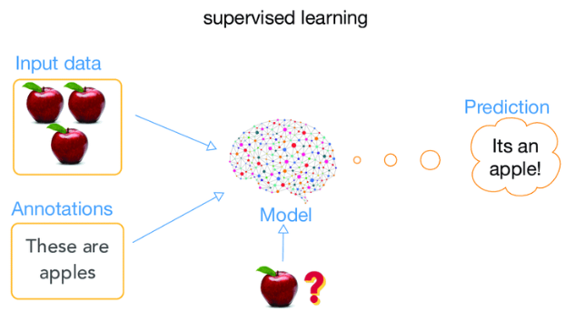
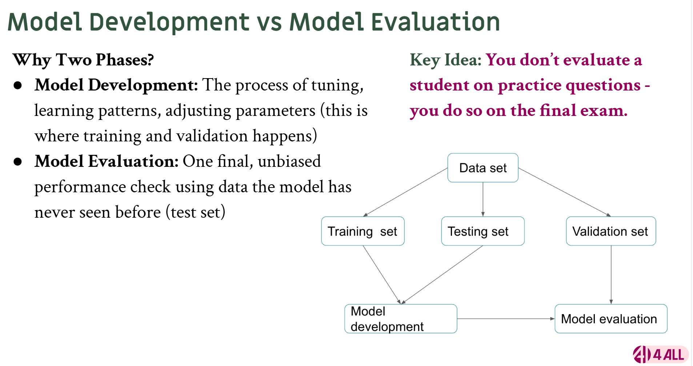
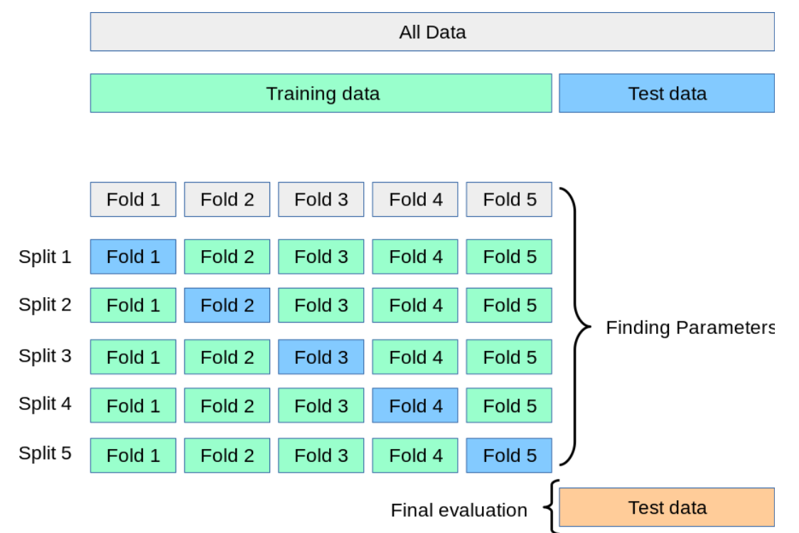

# NetFlix Movie Recommender

link to the dataset: **[Netflix popular movie dataset](https://www.kaggle.com/datasets/narayan63/netflix-popular-movies-dataset)**

I will use unsupervised learning

Note: Don't use all your data for the testing, it's not ideal. Check out week 5 video around 50 minutes in the video for explanation.
- instead use a split. Like 80-20, or 70-30
- Split the data into two parts:
    - Training Set (e.g., 80%): Learn patterns
    - Test Set (e.g., 20%): Evaluate performance on unseen data

But you will split your data into 3 groups:
- training set (70%)
- testing set (20%)
- validation set (10%)

## **Training and Testing Data**
### Training
Machine learning models are used to understand trends in data and making appropriate prediction based on it
**for all these model trends, they use curved data**
Underfit
- high biases
- data is curved but you are going in towards the data
- the line is going through the curved data
- biased towards linear regression
- this causes the model to underperform
- not complex enough
Optimal
- capturing general trend
- sweet spot for complexity
Overfit
- trying to track every data point
- high variance (too many variables)
- really complicated
- too complex
- problem
    - it memorizes instead of learning from the data so it will poorly perform with unseen data
    - no room to learn from data
    - too many variables as it is testing on every data point
    

Going back to the model testing and training:
But you will split your data into 2 major groups:
- training set (80%)
    - k-fold validation
- testing set (20%)
Example:
if we had 1000 rows of data, 80-20 is 800-200.
- 200 is for testing set and is truely unseen data, use at the end to avoid overfitting
- 800 is for training set and will be used in the form of k-fold validation (KFV or kfv)
- for KFV, we decide on how many groups we want to split out training set into, also known as k (common values are between 5 and 10 inclusive). We choose 5
- 800/5 is 160. We'll have 5 groups of 160 for training.

**Training stage**
For the training stage, since we chose 5 for groups (k = 5), we will have 5 training stages
- During the first stage, treat your **first set** of 160 rows as the **testing** set. Then train the remaining 640 (other 4 groups) as the training set and then train them on that specific testing set.
- During the second stage, treat your **second set** of 160 rows as the **testing** set. Then train on the remaining 640 rows.
- During the third stage, follow the same process. Do this for the remaining training stages.
- During each stage test your model using a metric (acuracy, mean square, etc...). Then you have 5 metric for 5 stages, then get the average of all these metric values. This prevents data leakage and overfitting.

### Testing
- Then after you have your average metric, conduct your final testing with your sacred/unseen set (the 20%, 200 rows of data)

## **Results**
- If your model performs very well on training folds but poorly on validation folds, that’s a sign of overfitting.
- A single train/test split can be:
    - Unstable (performance can vary greatly depending on which data falls into the test set),
    - Biased (it might not represent the true distribution of future data)

